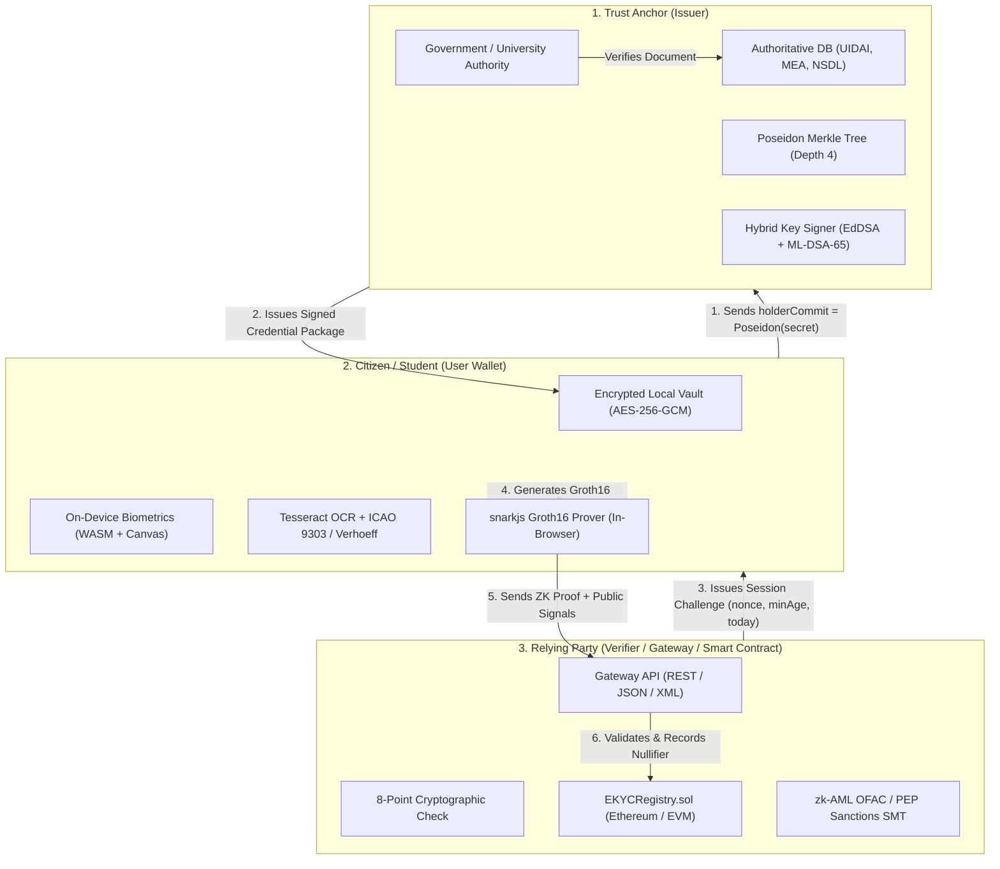
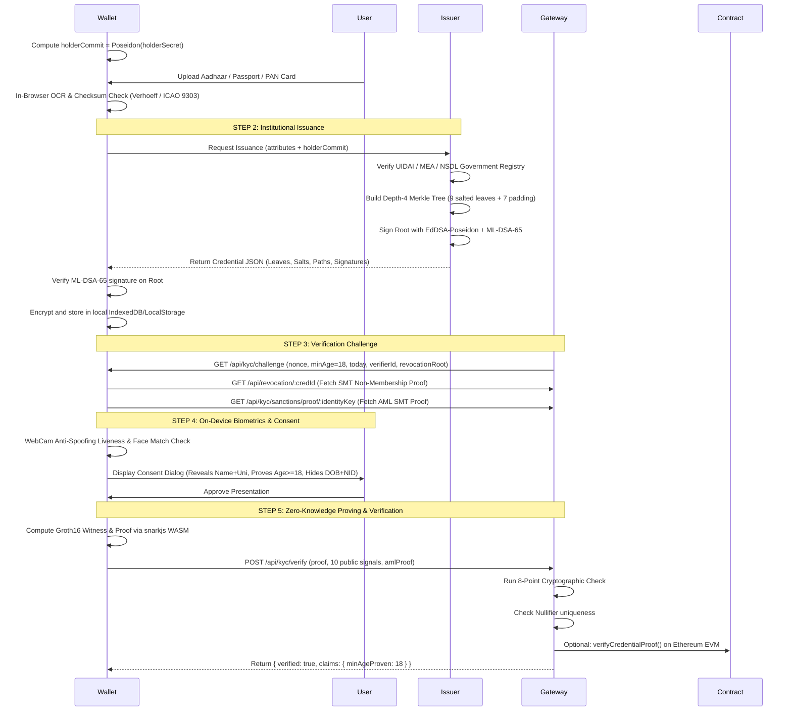
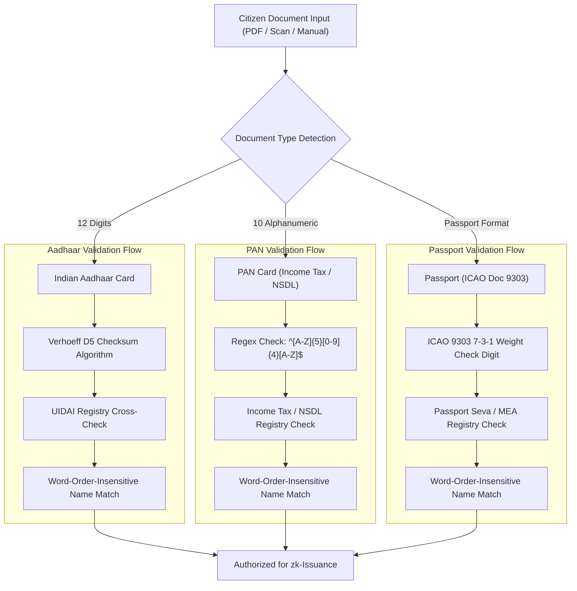
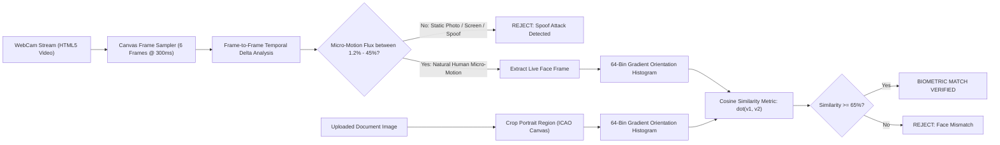
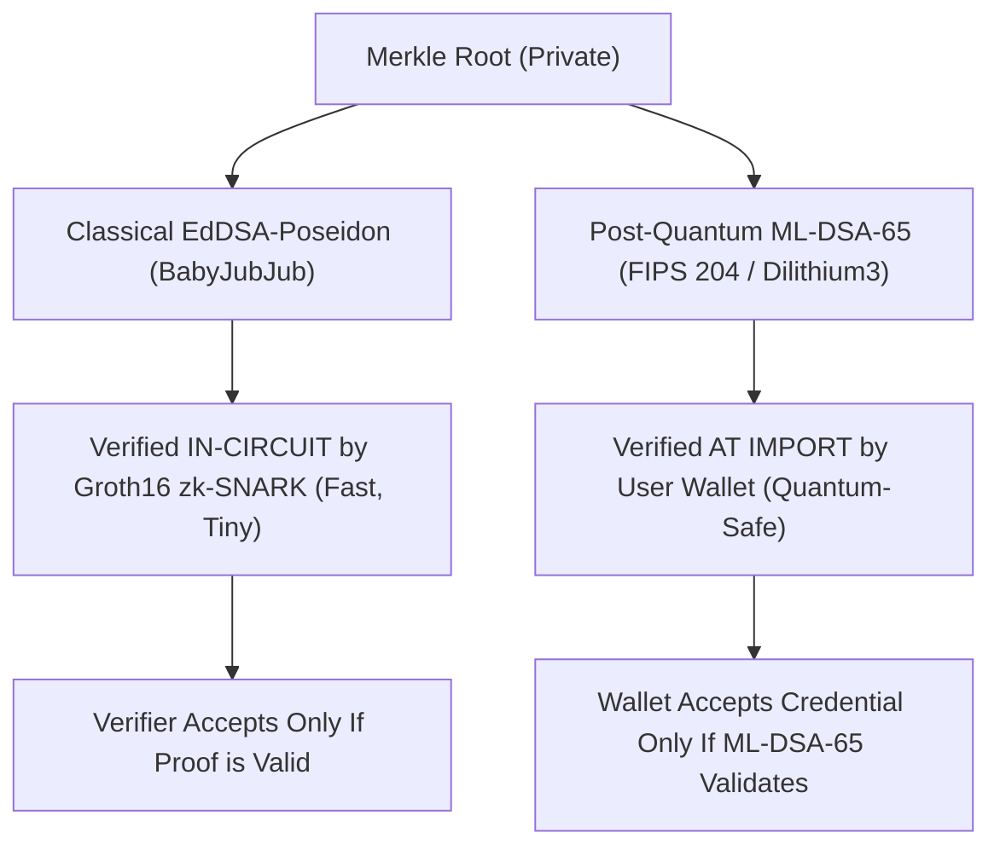
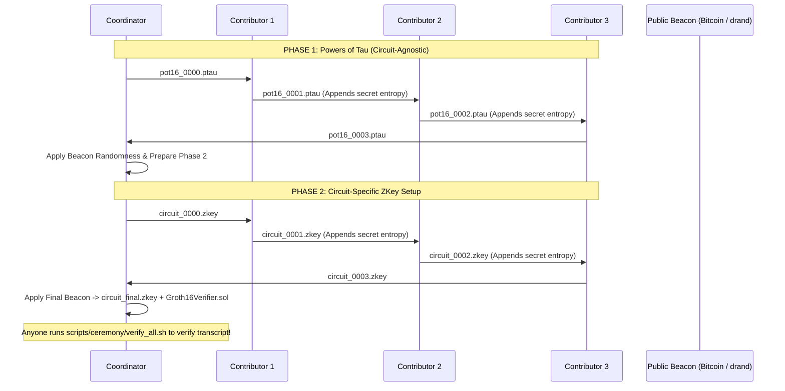

# 🛡️ Privacy-Preserving Selectively Disclosed eKYC System
### *Zero-Knowledge Proofs (zk-SNARKs) + Merkle Trees + Post-Quantum Signatures + On-Device Biometrics*

> **Based on the research paper:** *"A Privacy-Preserving Selectively Disclosed eKYC System Using Merkle Tree and Zero-Knowledge Proofs"* (Ahmed et al., APCC 2025), extended with **Production v2 Enterprise Features**: Post-Quantum Hybrid Cryptography (ML-DSA-65), In-Browser AI/OCR & Biometric Liveness Detection, Tri-Registry Government Validation (UIDAI / MEA / NSDL), and zk-AML Sanctions Screening.

---

## 📑 Table of Contents

1. [Executive Summary & Vision](#-executive-summary--vision)
2. [The Core Problem: Traditional KYC vs. Zero-Knowledge eKYC](#-the-core-problem-traditional-kyc-vs-zero-knowledge-ekyc)
3. [Zero-Knowledge Concepts Explained for Beginners](#-zero-knowledge-concepts-explained-for-beginners)
4. [High-Level Architecture & The Three-Party Trust Model](#-high-level-architecture--the-three-party-trust-model)
5. [End-to-End System Workflow](#-end-to-end-system-workflow)
6. [Circuit Architecture & Cryptographic Specification](#-circuit-architecture--cryptographic-specification)
7. [Tri-Registry Government Cross-Referencing & Document Authentication](#-tri-registry-government-cross-referencing--document-authentication)
8. [On-Device Biometric Engine & Anti-Spoofing Liveness](#-on-device-biometric-engine--anti-spoofing-liveness)
9. [Zero-Knowledge Anti-Money Laundering (zk-AML) Sanctions Screening](#-zero-knowledge-anti-money-laundering-zk-aml-sanctions-screening)
10. [Post-Quantum Security Layer (ML-DSA-65 / FIPS 204)](#-post-quantum-security-layer-ml-dsa-65--fips-204)
11. [Ethereum Smart Contracts (On-Chain Verification)](#-ethereum-smart-contracts-on-chain-verification)
12. [Repository Directory & File Breakdown](#-repository-directory--file-breakdown)
13. [Installation & Prerequisites](#-installation--prerequisites)
14. [Hands-On Quickstart & Step-by-Step Run Guide](#-hands-on-quickstart--step-by-step-run-guide)
15. [Running the Automated Test Suites](#-running-the-automated-test-suites)
16. [Enterprise Legacy Integration (REST, XML & Webhooks)](#-enterprise-legacy-integration-rest-xml--webhooks)
17. [Groth16 Multi-Party Trusted Setup Ceremony (MPC)](#-groth16-multi-party-trusted-setup-ceremony-mpc)
18. [Security, Privacy & Threat Model Analysis](#-security-privacy--threat-model-analysis)
19. [Frequently Asked Questions (FAQ) & Troubleshooting](#-frequently-asked-questions-faq--troubleshooting)

---

## 🌟 Executive Summary & Vision

Know Your Customer (**KYC**) is mandatory across global banking, education, telecommunications, and government services. However, the current standard forces individuals to upload unredacted scans of physical identification cards (Passports, National IDs, Driver's Licenses) and selfies to centralized corporate servers. 

This creates massive **honeypots of personal data**, leading to identity theft, document forgery, corporate surveillance, and catastrophic data breaches. Furthermore, traditional KYC causes **severe oversharing**: to prove you are over 18 or enrolled in a university, you must disclose your full legal name, exact birth date, home address, citizenship, and national ID number.

**This project solves this problem completely.**

Using **Zero-Knowledge Proofs (zk-SNARKs)** and **Merkle Tree Commitments**, this system allows a citizen or student to:
1. **Prove predicates** such as `Age >= 18` and `Credential is Not Expired` **without disclosing their Date of Birth or Expiry Date**.
2. **Selectively disclose** only what is required (e.g., `Full Name` and `University`), while keeping `National ID`, `Home Address`, and `Nationality` cryptographically concealed.
3. **Prove that the credential was issued by an authorized government/university authority** without disclosing the underlying Merkle root or issuer signature.
4. **Prove they are NOT on an international sanctions watchlist (OFAC/PEP)** without revealing who they are.
5. **Verify liveness and biometric face match 100% locally on the user's device** using WebAssembly and HTML5 Canvas—**no raw camera frames, biometric vectors, or face images are ever sent over the network**.
6. **Protect against quantum computing attacks** by wrapping credentials in a hybrid post-quantum digital signature (**EdDSA + ML-DSA-65 / FIPS 204**).

---

## ⚖️ The Core Problem: Traditional KYC vs. Zero-Knowledge eKYC

| Feature | Traditional KYC (Current Standard) | Zero-Knowledge eKYC (This Project) |
| :--- | :--- | :--- |
| **Data Transmission** | Full document scans (PDF/JPG) uploaded to cloud servers. | Only a mathematical zk-SNARK proof (~800 bytes) and authorized public signals are transmitted. |
| **Data Exposure** | Verifiers see your Date of Birth, National ID, Address, and Photo. | Verifier learns **ONLY** that `Age >= 18` is mathematically true. Date of Birth remains 100% hidden. |
| **Data Storage Risk** | High. Databases store millions of identity documents vulnerable to hacking. | Zero. Verifiers store only a cryptographic nullifier (hash) to prevent replays. |
| **Biometric Privacy** | Face videos and selfies sent to 3rd-party cloud biometric APIs. | Liveness & face geometry match run **completely client-side** inside the browser. Zero image transit. |
| **Revocation Check** | Centralized database lookup which tracks when and where you use your ID. | Cryptographic Sparse Merkle Tree (SMT) non-membership proof. Verifiers cannot track user activity. |
| **AML / Sanctions** | Centralized database scans matching your full name against watchlists. | Zero-knowledge proof of non-membership in the OFAC/UN sanctions tree. |
| **Replay Protection** | Often vulnerable to stolen credential PDFs reused by attackers. | Cryptographic single-use session nonces and unique nullifier hashes (`Poseidon(holderSecret, verifierId, nonce)`). |
| **Post-Quantum Ready** | No. Uses vulnerable RSA or ECDSA signatures. | Yes. Uses **ML-DSA-65 (FIPS 204 / Dilithium3)** post-quantum lattice signatures. |

---

## 🧠 Zero-Knowledge Concepts Explained for Beginners

If you have zero background in cryptography or zero-knowledge proofs, this section explains the foundational concepts in simple terms.

### 1. What is a Zero-Knowledge Proof (ZKP)?
A Zero-Knowledge Proof is a mathematical protocol that enables one party (the **Prover**) to prove to another party (the **Verifier**) that a statement is true, **without revealing any information beyond the validity of the statement itself**.
* *Classic Analogy*: Imagine proving to someone you know the password to a secret room by entering the room and bringing out a requested object, without ever telling them the password.
* *In This Project*: You prove you were born on or before `2008-01-01` (meaning you are 18+) without ever showing whether your birthday is `1995-04-12`, `2002-08-15`, or `2006-03-20`.

### 2. What is zk-SNARK & Groth16?
* **zk-SNARK** stands for *Zero-Knowledge Succinct Non-Interactive Argument of Knowledge*.
  * **Succinct**: The proof is tiny (~800 bytes) and verifies in milliseconds (0.01–0.05 seconds), regardless of how complex the computation is.
  * **Non-Interactive**: The Prover creates the proof once and sends it to the Verifier or a blockchain smart contract without requiring back-and-forth dialogue.
* **Groth16** is the gold-standard, most constraint-efficient zk-SNARK proof system in production today. It uses pairing-friendly elliptic curves (**BN128 / alt_bn128**).

### 3. What is a Poseidon Hash?
Standard cryptographic hashes like SHA-256 or Keccak-256 are designed for standard binary computers, requiring tens of thousands of CPU bit-shift and XOR gates. This makes them extremely expensive and slow to compute inside a zero-knowledge circuit.
**Poseidon** is an algebraic hash function designed specifically for zero-knowledge arithmetic circuits over prime fields. In our system, computing a Poseidon hash takes only ~240 constraints instead of ~25,000 constraints for SHA-256.

### 4. What is a Merkle Tree & Salted Leaf?
A **Merkle Tree** is a binary tree where every leaf is the cryptographic hash of a data piece, and every parent node is the hash of its children, culminating in a single **Merkle Root**.
* In our credential, we take the holder's 6 attributes (Name, DOB, Nationality, National ID, Address, University).
* Each attribute is salted with random entropy: `Leaf_i = Poseidon(Value_i, Salt_i)`.
* **Why the Salt?** If someone's nationality is `"IND"`, a brute-force attacker could pre-compute `Poseidon("IND")` and guess the value. The random 256-bit salt makes brute-force dictionary attacks mathematically impossible.

### 5. What is a Sparse Merkle Tree (SMT) for Revocation and Sanctions?
A **Sparse Merkle Tree** is a massive Merkle tree of fixed depth (in our project, $2^{20} = 1,048,576$ leaves) that is initialized completely empty.
* When a credential is revoked, its `credId` is inserted into the revocation SMT.
* When presenting a credential, the holder provides a **cryptographic proof of non-membership**: a mathematical proof that their `credId` is NOT among the revoked leaves in the SMT, matching the current published root.
* The same technique powers our **zk-AML Screening**: proving that `Poseidon(Name, DOB)` is NOT inside the international sanctions list.

### 6. What is a Nullifier?
If a zero-knowledge proof hides all personal identifiers, how do we stop an attacker from recording someone's valid proof and re-submitting it thousands of times (a **replay attack**) or double-spending an identity?
A **Nullifier** is a deterministic pseudo-random tag calculated inside the circuit:
$$\text{Nullifier} = \text{Poseidon}(\text{holderSecret}, \text{verifierId}, \text{nonce})$$
* It can only be generated by the legitimate owner of `holderSecret`.
* It is bound to the specific verifier (`verifierId`) and the unique session (`nonce`).
* The verifier registers the nullifier in a fast lookup store (or smart contract mapping). If the same nullifier appears twice, it is immediately rejected.
* Because the nullifier changes with every verifier and nonce, different services cannot link your transactions together (ensuring **unlinkability**).

---

## 🏛️ High-Level Architecture & The Three-Party Trust Model

The system follows the decentralized Self-Sovereign Identity (SSI) paradigm composed of three distinct actors:



1. **The Issuer** (UIDAI, Ministry of External Affairs, Passport Office, University):
   - Authenticates the user's physical document against official databases.
   - Computes salted Poseidon leaves for each attribute and constructs a depth-4 Merkle Tree.
   - Signs the Merkle Root using a **Hybrid Signature** (classical EdDSA-Poseidon + quantum-resistant ML-DSA-65).
   - **Crucial Security Rule**: The Issuer *never* sees or learns the user's private `holderSecret`. The user only provides `holderCommit = Poseidon(holderSecret)`.

2. **The Holder** (Citizen/Student using Web Wallet or CLI):
   - Generates their `holderSecret` locally in their browser.
   - Holds their credentials in a client-side AES-256-GCM encrypted vault.
   - Receives challenges from verifiers, runs on-device biometric liveness checks, and builds Groth16 proofs completely client-side in WebAssembly.

3. **The Verifier** (Bank, Telecom, Employer, or On-Chain Smart Contract):
   - Issues a fresh cryptographic nonce and policy requirements (e.g., `minAge = 18`).
   - Verifies the Groth16 proof, EdDSA trust anchor, clock synchronization, SMT non-revocation status, and AML non-sanctions status.
   - Never learns the user's birthdate, document numbers, address, or Merkle root.

---

## 🔄 End-to-End System Workflow

The following sequence diagram details the full cryptographic lifecycle:



---

## ⚡ Circuit Architecture & Cryptographic Specification

The circuit is implemented in **Circom 2.1.9** and located at [`circuits/selective_disclosure.circom`](file:///C:/Users/negik/Downloads/Project/ekyc-zkp_updated/ekyc-zkp/circuits/selective_disclosure.circom).

### Merkle Tree Layout (Depth 4 = 16 Leaves)
The circuit defines fixed slot assignments for attributes. Because positions are hardcoded in the circuit templates, path directions are constants rather than private witness variables, saving significant circuit constraints:

| Slot Index | Attribute Name | Circuit Constant | Visibility in Proof | Description |
| :---: | :--- | :--- | :---: | :--- |
| **0** | `name` | `IDX_NAME` | **Public** | Name converted to prime field via SHA-256 mod $p$. |
| **1** | `dob` | `IDX_DOB` | 🔒 **Private** | Date of Birth as an integer: `YYYYMMDD`. |
| **2** | `nationality` | *(Unchecked)* | 🔒 **Private** | ISO-3166 3-letter country code (e.g. `IND`). |
| **3** | `nid` | *(Unchecked)* | 🔒 **Private** | National ID / Passport number string. |
| **4** | `address` | *(Unchecked)* | 🔒 **Private** | Residential address string. |
| **5** | `university` | `IDX_UNI` | **Public** | University or issuing organization name. |
| **6** | `holderCommit`| `IDX_HOLDER` | 🔒 **Private** | Bound to secret: `holderCommit == Poseidon(holderSecret)`. |
| **7** | `expiry` | `IDX_EXPIRY` | 🔒 **Private** | Expiry date as an integer: `YYYYMMDD`. |
| **8** | `credId` | `IDX_CREDID` | 🔒 **Private** | Unique integer ID (1..1,048,575) used as SMT key. |
| **9..15**| *Padding* | `0` | 🔒 **Private** | Zero-padding leaves to complete depth-4 tree. |

### Circuit Signals Breakdown

```mermaid
graph LR
    subgraph PrivateInputs ["Private Inputs (Secret Witness)"]
        merkleRoot["merkleRoot (Root of Merkle Tree)"]
        sig["EdDSA Signature (R8x, R8y, S)"]
        holderSecret["holderSecret"]
        dob["dob (YYYYMMDD)"]
        expiry["expiry (YYYYMMDD)"]
        credId["credId (SMT Key)"]
        salts["6x Salts (name, dob, uni, holder, exp, credId)"]
        paths["6x Merkle Sibling Paths [4]"]
        smtWitness["SMT Non-Membership Witness (siblings[20], oldKey, oldValue, isOld0)"]
    end

    subgraph Circuit ["Circom Circuit: SelectiveDisclosure(4)"]
        c1["1. EdDSAPoseidonVerifier (Validates signature on merkleRoot)"]
        c2["2. Poseidon(holderSecret) == leaf[6] (Holder Binding)"]
        c3["3. 6x FixedMerkleInclusion (Attribute Inclusion Checks)"]
        c4["4. LessEqThan(32): dob <= today - minAge*10000"]
        c5["5. GreaterThan(32): expiry > today"]
        c6["6. SMTVerifier(20): credId NOT in revocationRoot"]
        c7["7. Poseidon(holderSecret, verifierId, nonce) -> nullifier"]
    end

    subgraph PublicSignals ["10 Public Signals (Outputs & Inputs)"]
        p0["0: nullifier (Output)"]
        p1["1: issuerAx"]
        p2["2: issuerAy"]
        p3["3: today (YYYYMMDD)"]
        p4["4: minAge"]
        p5["5: nameValue"]
        p6["6: uniValue"]
        p7["7: verifierId"]
        p8["8: nonce"]
        p9["9: revocationRoot"]
    end

    PrivateInputs --> Circuit
    Circuit --> PublicSignals
```



### Constraints & Mathematical Verification Inside the Circuit
1. **Issuer Signature Verification**:
   The circuit incorporates `EdDSAPoseidonVerifier()` from `circomlib`. It verifies that the private `merkleRoot` was signed by the issuer key `(issuerAx, issuerAy)`. The verifier never sees `merkleRoot`, yet knows it was signed by an authorized issuer!
2. **Holder Commitment Binding**:
   The circuit calculates `Poseidon(holderSecret)` and enforces that it matches `leaf[6]`. An attacker who steals a credential file cannot use it without knowing `holderSecret`.
3. **Merkle Inclusions**:
   All 6 verified leaves (name, dob, uni, holderCommit, expiry, credId) must evaluate to the identical private `merkleRoot`.
4. **Age Logic (No Modulo / Negative Field Wrap)**:
   $$\text{threshold} = \text{today} - \text{minAge} \times 10000$$
   Both `dob` and `threshold` pass through 32-bit range checks (`Num2Bits(32)`). A `LessEqThan(32)` component proves $\text{dob} \le \text{threshold}$. If a prover tries to cheat with field wrapping, the 32-bit constraint fails.
5. **Expiry Check**:
   A `GreaterThan(32)` component proves $\text{expiry} > \text{today}$.
6. **Sparse Merkle Tree Non-Revocation**:
   An `SMTVerifier(20)` verifies that `credId` is absent from the 20-level Sparse Merkle Tree represented by public input `revocationRoot`.
7. **Nullifier Constraint**:
   The public output `nullifier` is calculated via $\text{Poseidon}(\text{holderSecret}, \text{verifierId}, \text{nonce})$.

---

## 🏛️ Tri-Registry Government Cross-Referencing & Document Authentication

To prevent fraudulent self-issuance and fake identification numbers, the system features a **Tri-Registry Verification Engine** ([`src/registry.js`](file:///C:/Users/negik/Downloads/Project/ekyc-zkp_updated/ekyc-zkp/src/registry.js)) combined with mathematical check digit validation:



### 1. Indian Aadhaar Card (UIDAI)
* **Verhoeff D5 Checksum Algorithm**: Validates the 12th digit of Aadhaar numbers. The Verhoeff algorithm uses dihedral group $D_5$ permutations to catch 100% of single-digit transposition errors and common typo patterns.
* **UIDAI Registry Matching**: Cross-checks against the official UIDAI database (`data/government-registry.json`).
* **Name Normalization**: Names are normalized with word-order-insensitivity (`normalizeName("Karan Singh Negi") == normalizeName("NEGI KARAN SINGH")`).
* **Anti-Leak Defense**: Rejections return generic `NAME_MISMATCH` errors without revealing the actual registered name to prevent fishing attacks.

### 2. Indian PAN Card (Income Tax Department / NSDL)
* **Structure Validation**: Validates the 10-character alphanumeric syntax: 5 uppercase letters, 4 digits, 1 uppercase letter (`NEGPK1234N`).
* **NSDL Registry Verification**: Matches registered PAN records with PAN status and associated tax identity.

### 3. International Passports (MEA / Passport Seva)
* **ICAO Doc 9303 (TD3 MRZ)**: Machine-Readable Travel Documents use modulus-10 check digits with repetitive weighting factors `[7, 3, 1]`. The engine parses MRZ lines and validates document authenticity automatically.

---

## 👁️ On-Device Biometric Engine & Anti-Spoofing Liveness

Implemented in [`wallet/biometrics.mjs`](file:///C:/Users/negik/Downloads/Project/ekyc-zkp_updated/ekyc-zkp/wallet/biometrics.mjs), the biometric module operates **entirely inside the user's browser**:



### Anti-Spoofing Liveness Verification
* Takes sequential frame samples over a 1.8-second window while guiding the user with interactive prompts (*"Look directly at the camera"*, *"Please blink your eyes naturally"*).
* Evaluates frame-to-frame pixel dynamics across RGB channels.
* Static printed photos and screen replays have pixel motion $< 0.5\%$, while video loops/sudden transitions exceed $45\%$. Natural living human movement falls cleanly in the range $[1.2\%, 45\%]$.

### Facial Geometry & Cosine Similarity
* Calculates a normalized 64-bin gradient orientation vector (Histogram of Oriented Gradients) for both the live camera snapshot and the cropped document photograph.
* Computes cosine similarity:
  $$\text{Similarity} = \frac{\mathbf{v}_{\text{live}} \cdot \mathbf{v}_{\text{doc}}}{\|\mathbf{v}_{\text{live}}\| \|\mathbf{v}_{\text{doc}}\|}$$
* If similarity $\ge 65\%$, biometric matching passes.
* **Strict Privacy Rule**: Video streams, canvas elements, and feature vectors exist solely in volatile browser RAM and are immediately garbage-collected. **Zero bytes of biometric data leave the device.**

---

## 🚫 Zero-Knowledge Anti-Money Laundering (zk-AML) Sanctions Screening

Traditional AML screening requires users to disclose their identity to third-party databases, tracking who conducts transactions. In this system ([`src/aml.js`](file:///C:/Users/negik/Downloads/Project/ekyc-zkp_updated/ekyc-zkp/src/aml.js)):

1. An international sanctions watchlist (simulating OFAC Specially Designated Nationals and PEPs) is compiled into a 20-level Sparse Merkle Tree (SMT).
2. Each sanctioned entry has an identity key:
   $$\text{Key} = \big(\text{Poseidon}(\text{toField}(\text{Name}), \text{DOB}) \pmod{2^{20}-1}\big) + 1$$
3. When verifying, clean users compute their own identity key and generate a **cryptographic non-membership proof** (`circomlibjs SMT find()`).
4. The gateway verifies that the user's non-membership proof matches the current authoritative `sanctionsRoot`.
5. If a sanctioned person attempts to generate a proof, the SMT finder detects inclusion and throws an immediate error: `Identity matches an entry on the AML/Sanctions watchlist!`.

---

## ⚛️ Post-Quantum Security Layer (ML-DSA-65 / FIPS 204)

Standard zk-SNARK credentials rely on elliptic curves (BabyJubJub, Ed25519, secp256k1) which are vulnerable to Shor's algorithm on large-scale quantum computers.

This project introduces a **Hybrid Post-Quantum Signing Architecture** ([`src/crypto-suite.js`](file:///C:/Users/negik/Downloads/Project/ekyc-zkp_updated/ekyc-zkp/src/crypto-suite.js)):



* **Classical In-Circuit Signature**: EdDSA over BabyJubJub is verified inside the SNARK circuit, keeping proof generation fast (~1.4s) and verification succinct (~0.2s).
* **Quantum-Resistant Import Signature**: The Merkle root is simultaneously signed using **ML-DSA-65** (the official NIST FIPS 204 lattice-based standard).
* During wallet import, the client wallet verifies the ML-DSA-65 signature against the trusted issuer's public key (`data/issuer-public.json`). Any forged or downgraded signature is instantly rejected before storage.

---

## ⛓️ Ethereum Smart Contracts (On-Chain Verification)

The project includes production-ready Solidity smart contracts in [`contracts/`](file:///C:/Users/negik/Downloads/Project/ekyc-zkp_updated/ekyc-zkp/contracts/):

### 1. `EKYCRegistry.sol`
* **Trust Anchor**: Stores authorized issuer public key hashes (`keccak256(Ax, Ay)`).
* **Revocation Synchronization**: Authorized issuers update `revocationRoot` on-chain.
* **Front-Running & Replay Protection**:
  * Binds `verifierId` to `uint256(uint160(msg.sender))`. A front-runner on the blockchain mempool cannot intercept a user's proof and submit it as their own verification.
  * Maintains the `usedNullifier[nullifier] = true` mapping to prevent replay attacks.
* **Clock Drift Verification**: Implements civil date conversion (H. Hinnant's algorithm) to guarantee that the proof's `today` signal matches UTC today or yesterday relative to `block.timestamp`.

### 2. `Groth16Verifier.sol`
* Generated directly from the circuit's trusted setup.
* Implements pairing checks over the BN128 elliptic curve:
  $$e(A, B) = e(\alpha, \beta) \cdot e(x_i \cdot \gamma, \delta) \cdot e(C, \delta)$$

---

## 📁 Repository Directory & File Breakdown

Below is the complete architectural map of every folder and critical file in the project:

```
ekyc-zkp_updated/
├── ekyc-zkp/                          # Primary codebase root
│   ├── build/                         # Compiled artifacts & cryptographic keys
│   │   ├── circuit_final.zkey         # Groth16 proving key (BN128, 18.5 MB)
│   │   ├── verification_key.json      # Groth16 verification key (JSON)
│   │   ├── selective_disclosure.r1cs  # Rank-1 Constraint System (5.6 MB)
│   │   └── selective_disclosure_js/   # WASM witness generator for in-browser proving
│   │       ├── selective_disclosure.wasm
│   │       └── witness_calculator.js
│   ├── circuits/                      # Zero-Knowledge Circuit definitions
│   │   └── selective_disclosure.circom# Circom 2.1.9 Selective Disclosure circuit
│   ├── contracts/                     # Solidity smart contracts
│   │   ├── EKYCRegistry.sol           # On-chain issuer registry, revocation & nullifiers
│   │   └── Groth16Verifier.sol        # EVM-compatible Groth16 pairing verifier
│   ├── data/                          # Runtime data, trust anchors & registries
│   │   ├── government-registry.json   # UIDAI (Aadhaar), MEA (Passport), NSDL (PAN) database
│   │   ├── issuer-public.json         # Issuer trust anchor (EdDSA + ML-DSA-65 public keys)
│   │   ├── issuer.key                 # Issuer private EdDSA key
│   │   ├── issuer.pq.seed             # Issuer ML-DSA-65 seed
│   │   ├── revocation.json            # Active revoked credIds & SMT root
│   │   ├── sanctions.json             # OFAC SDN / PEP sanctions watchlist entries
│   │   └── nullifiers.json            # Registry of spent nullifiers
│   ├── gateway/                       # REST/HTTP Gateway server
│   │   └── server.js                  # Express-free Node.js HTTP server (JSON/XML/REST)
│   ├── legacy/                        # Enterprise backward-compatibility tools
│   │   ├── curl-examples.sh           # cURL commands demonstrating legacy API calls
│   │   ├── mapping.json               # Column mapping schema for CSV imports
│   │   └── sample-customers.csv       # Sample legacy banking/university records
│   ├── scripts/                       # Developer CLI tools & setup scripts
│   │   ├── common.js                  # Shared crypto utilities (Poseidon, EdDSA, Tree utils)
│   │   ├── issuer.js                  # CLI: Issue credential from JSON request
│   │   ├── holder.js                  # CLI: Present credential & generate Groth16 proof
│   │   ├── verifier.js                # CLI: Verify presentation against trust anchor
│   │   ├── import-legacy.js           # CLI: Bulk-issue credentials from legacy CSV
│   │   ├── setup.sh                   # Circom compiler and single-party demo setup
│   │   └── ceremony/                  # Multi-party trusted setup scripts (Phase 1 & 2)
│   │       ├── phase1_init.sh
│   │       ├── phase1_contribute.sh
│   │       ├── phase1_beacon_and_prepare.sh
│   │       ├── phase2_setup.sh
│   │       ├── phase2_contribute.sh
│   │       ├── phase2_finalize.sh
│   │       └── verify_all.sh
│   ├── src/                           # Core business logic modules
│   │   ├── aml.js                     # zk-AML Sparse Merkle Tree & non-membership logic
│   │   ├── crypto-suite.js            # Post-quantum hybrid ML-DSA-65 + EdDSA suite
│   │   ├── issuer-core.js             # Merkle tree leaf builder & credential issuer
│   │   ├── registry.js                # Tri-Registry check (Aadhaar, Passport, PAN)
│   │   ├── revocation.js              # 20-level Revocation SMT manager
│   │   ├── verify-core.js             # 8-Point presentation verification engine
│   │   └── wallet-core.mjs            # Isomorphic wallet engine (PBKDF2 + AES-GCM)
│   ├── test/                          # Comprehensive automated test suites
│   │   ├── e2e.js                     # 13 End-to-end integration tests
│   │   ├── registry.test.js           # 20 Government registry unit tests
│   │   └── aml.test.js                # 3 zk-AML sanctions unit tests
│   ├── vendor/                        # Client-side vendor libraries
│   │   └── snarkjs.min.js             # Standalone client-side snarkjs runtime
│   ├── wallet/                        # Browser-based Zero-Knowledge Identity Vault
│   │   ├── biometrics.mjs             # WebCam liveness detection & face matching
│   │   ├── doc-import.mjs             # In-browser OCR (Tesseract.js) & PDF parser (PDF.js)
│   │   ├── index.html                 # Complete responsive single-page web app
│   │   └── vendor/                    # Local WASM engines (PDF.js, Tesseract, Circomlibjs)
│   ├── CEREMONY.md                    # Multi-Party Trusted Setup Ceremony protocol guide
│   ├── package.json                   # Project metadata, scripts, and dependencies
│   └── README.md                      # This comprehensive documentation file
```

---

## 🛠️ Installation & Prerequisites

### System Requirements
* **Operating System**: Windows 10/11, macOS, or Linux (Ubuntu 20.04+ recommended).
* **Node.js**: `v20.0.0` or higher (Node 22 LTS supported).
* **npm**: `v9.0.0` or higher.
* **circom**: `v2.1.9` (Required if re-compiling circuits; pre-compiled build files are included).
* **OpenSSL**: Available on PATH.

### Installation Steps

1. **Clone or Navigate to the Project Directory**:
   ```bash
   cd ekyc-zkp_updated/ekyc-zkp
   ```

2. **Install Node Dependencies**:
   ```bash
   npm install
   ```

3. **Verify Prebuilt Cryptographic Keys**:
   The repository already includes pre-compiled circuit artifacts in `build/` (`selective_disclosure.r1cs`, `circuit_final.zkey`, and `selective_disclosure.wasm`). You can immediately run tests and launch the app without re-compiling!

---

## 🚀 Hands-On Quickstart & Step-by-Step Run Guide

### Option A: Complete Browser-Based Interactive Experience (Recommended)

1. **Start the eKYC Gateway and Web Vault**:
   ```bash
   npm start
   ```
   *Output:*
   ```text
   eKYC gateway on http://localhost:3000  (wallet UI: /wallet)
   ```

2. **Open the Web Vault in Your Browser**:
   Open **`http://localhost:3000/wallet`** in Chrome, Firefox, or Edge.

3. **Step 1: Document Authenticity & Verification**:
   * **Tab 1 (Upload Document)**: Upload a sample Aadhaar, PAN, or Passport scan/PDF. The built-in client-side OCR (Tesseract.js + PDF.js) extracts name, birthdate, and document number locally.
   * **Tab 2 (Manual Entry)**: Select document type (`Indian Aadhaar`, `Passport`, or `PAN Card`). Enter your details. Real-time checksums (**Verhoeff $D_5$** for Aadhaar, **ICAO 9303** for Passport) validate the number dynamically against the government database!

4. **Step 2: Biometric Liveness & Face Match**:
   * Click **"Start Biometric Liveness & Match"**.
   * Grant WebCam access. Follow the on-screen prompts (*"Look directly at the camera"*, *"Blink naturally"*).
   * The local AI validates natural micro-motion and compares your face geometry to the photo.

5. **Step 3: zk-AML Watchlist Screening**:
   * Click **"Check Sanctions Non-Membership"**.
   * The wallet computes your identity commitment and verifies that you are NOT on the OFAC/UN sanctions list.

6. **Step 4: Request Issuance & Verify Proof**:
   * Click **"Request Issuance"**: The server checks the government registry and signs the Merkle root with EdDSA + ML-DSA-65.
   * Click **"Verify ZK Proof (Age >= 18)"**: Your browser computes the Groth16 proof in WebAssembly (~1.4 seconds) and submits it to `/api/kyc/verify`.
   * **Result**: `✔ VERIFIED & ACCEPTED: Age >= 18 proven without disclosing DOB!`

---

### Option B: Command-Line Interface (CLI) Walkthrough

For backend developers or automated pipelines, the entire workflow can be executed via terminal scripts:

1. **Step 1: Issue a Credential**:
   ```bash
   node scripts/issuer.js
   ```
   *This loads `data/issue-request.json`, computes the salted Poseidon Merkle Tree, signs the root with EdDSA and ML-DSA-65, and writes the credential to `data/credentials/<credId>.json`.*

2. **Step 2: Present and Generate Zero-Knowledge Proof**:
   ```bash
   # Syntax: node scripts/holder.js <nonce> <minAge>
   node scripts/holder.js 123456789 18
   ```
   *The holder loads the credential, checks SMT non-revocation status, generates the Groth16 proof using snarkjs, and outputs `data/presentation.json` and `data/public.json`.*

3. **Step 3: Verify the Proof**:
   ```bash
   # Syntax: node scripts/verifier.js <expectedNonce> <expectedMinAge>
   node scripts/verifier.js 123456789 18
   ```
   *Output:*
   ```text
   1. Groth16 proof (10 public signals): OK
   2. issuer (Ax,Ay) matches trust anchor: OK
   3. today within clock window (UTC yesterday|today): OK
   4. minAge equals policy: OK
   5. verifierId is ours: OK
   6. nonce equals session nonce: OK
   7. revocationRoot equals registry's current root: OK
   8. nullifier not used before: OK
   ACCEPTED
   ```

---

## 🧪 Running the Automated Test Suites

The project features a rigorous automated test suite covering unit, integration, and security edge cases:

```bash
npm test
```

### What `npm test` Executes:

1. **Government Registry Tests (`test/registry.test.js`)**:
   - Word-order-insensitive name matching (`normalizeName`).
   - Genuine Aadhaar matching in UIDAI database.
   - Non-existent Aadhaar rejection (`UID_NOT_FOUND`).
   - Imposter name rejection without leaking real names (`NAME_MISMATCH`).
   - Wrong DOB rejection (`DOB_MISMATCH`).
   - Genuine Passport matching in Passport Seva database.
   - Fake Passport rejection (`PASSPORT_NOT_FOUND`).
   - Genuine PAN card matching in NSDL database (`NEGPK1234N`).
   - Dynamic citizen registration and instantaneous verification.

2. **zk-AML Sanctions Unit Tests (`test/aml.test.js`)**:
   - Computes 20-level sanctions SMT root.
   - Generates valid non-membership proof for an unsanctioned citizen.
   - Accurately blocks and throws errors for simulated sanctioned individuals (`VLADIMIR ILLYICH`).

3. **End-to-End Cryptographic & Gateway Tests (`test/e2e.js`)**:
   - Happy path: Valid proof accepted with hybrid EdDSA + ML-DSA-65 signatures.
   - Privacy guarantee: Asserts that presentation JSON leaks zero attributes, DOB, or salts.
   - Replay protection: Re-submitting the same session is rejected.
   - Session binding: Proof generated for another nonce is rejected.
   - Post-quantum defense: Tampered ML-DSA-65 signature is rejected at wallet import.
   - Trust anchor enforcement: Self-issued credential from an untrusted issuer is rejected.
   - Legacy cross-matching: Verifier `expect` parameter correctly validates or rejects claims.
   - Legacy XML: Successfully parses and returns XML payloads.
   - User consent: Rejecting consent halts proof generation.
   - Predicate enforcement: Proving `Age >= 40` for a 37-year-old fails.
   - Encryption security: Vault storage is verified to be ciphertext; wrong passphrase fails decryption.

---

## 🏢 Enterprise Legacy Integration (REST, XML & Webhooks)

Legacy banking, insurance, and ERP platforms cannot run zero-knowledge provers natively. The gateway (`gateway/server.js`) bridges this gap with standard REST, JSON, XML, and Webhook interfaces:

### 1. Requesting a Verification Challenge
```bash
curl -X GET "http://localhost:3000/api/kyc/challenge?minAge=18"
```
*Response (JSON):*
```json
{
  "sessionId": "a1b2c3d4-e5f6-7890-abcd-ef0123456789",
  "nonce": "104928502938491029384",
  "minAge": "18",
  "today": 20261005,
  "verifierId": "21849104928104820194820194",
  "revocationRoot": "15893029482019482019482019",
  "sanctionsRoot": "15278126419530129482019482"
}
```

### 2. Verifying a Presentation (JSON)
```bash
curl -X POST "http://localhost:3000/api/kyc/verify" \
  -H "Content-Type: application/json" \
  -d '{
    "sessionId": "a1b2c3d4-e5f6-7890-abcd-ef0123456789",
    "proof": { ... },
    "publicSignals": [ ... ],
    "expect": {
      "name": "Ahmed",
      "university": "Osaka Metropolitan University"
    }
  }'
```

### 3. Legacy XML Support
For older SOAP and banking systems, send `Accept: application/xml`:
```bash
curl -X POST "http://localhost:3000/api/kyc/verify" \
  -H "Content-Type: application/json" \
  -H "Accept: application/xml" \
  -d '{ ... }'
```
*Response (XML):*
```xml
<?xml version="1.0"?>
<kycResult>
  <verified>true</verified>
  <sessionId>a1b2c3d4-e5f6-7890-abcd-ef0123456789</sessionId>
  <reason></reason>
  <minAgeProven>18</minAgeProven>
</kycResult>
```

### 4. Bulk CSV Migration for Legacy Users
To migrate legacy customer databases into privacy-preserving credentials:
```bash
node scripts/import-legacy.js legacy/sample-customers.csv
```
*Reads columns mapped in `legacy/mapping.json`, registers holder commitments, and bulk-issues credentials into `data/credentials/`.*

---

## 🔒 Groth16 Multi-Party Trusted Setup Ceremony (MPC)

Groth16 requires a one-time **Trusted Setup** to generate the proving key (`circuit_final.zkey`) and verification key (`verification_key.json`). If a single party conducts this setup, the temporary cryptographic randomness ("toxic waste") could theoretically be used to forge proofs.

To eliminate this trust assumption, the project includes a complete, production-grade **Multi-Party Computation (MPC) Ceremony** protocol detailed in [`CEREMONY.md`](file:///C:/Users/negik/Downloads/Project/ekyc-zkp_updated/ekyc-zkp/CEREMONY.md) and scripted in [`scripts/ceremony/`](file:///C:/Users/negik/Downloads/Project/ekyc-zkp_updated/ekyc-zkp/scripts/ceremony/):



* **Security Guarantee**: As long as **at least one** contributor acts honestly and destroys their randomness, the entire setup is mathematically secure and proofs cannot be forged.
* **Public Verifiable Random Beacon**: Uses the hash of a future Bitcoin block or drand round committed before publication to prevent coordinator manipulation.

---

## 🛡️ Security, Privacy & Threat Model Analysis

### 1. Replay Attacks
* **Threat**: An attacker snoops on network traffic, captures a user's proof, and submits it to another verifier.
* **Defense**: The proof includes a public `nonce` and `verifierId`. The derived nullifier $\text{Poseidon}(\text{holderSecret}, \text{verifierId}, \text{nonce})$ is single-use and tied directly to the receiving verifier. Replaying the proof elsewhere will fail either the nonce check or the nullifier uniqueness check.

### 2. Credential Theft / Transfer Attacks
* **Threat**: Alice gives her credential JSON file to Bob so Bob can pass an age check.
* **Defense**: The credential contains leaf 6: $\text{holderCommit} = \text{Poseidon}(\text{holderSecret})$. To generate a valid Groth16 proof, the circuit demands the preimage `holderSecret`. Giving Bob the credential file without the secret renders it useless; giving Bob the secret transfers complete ownership of all Alice's credentials and nullifiers.

### 3. Self-Issuance / Impersonation
* **Threat**: An attacker creates their own keys, issues a fake credential stating they are 25 years old, and presents it.
* **Defense**: The verifier checks public signals `(issuerAx, issuerAy)` against the authorized trust anchor (`data/issuer-public.json` or the on-chain `issuerKeys` mapping in `EKYCRegistry.sol`). Proofs with unknown issuer keys are immediately rejected.

### 4. Front-Running on Ethereum
* **Threat**: In an on-chain deployment, an attacker watches the Ethereum mempool for a user's `verifyCredentialProof()` transaction, extracts the proof, and submits it from their own address with a higher gas price.
* **Defense**: The circuit requires public input `verifierId`, which `EKYCRegistry.sol` strictly enforces:
  ```solidity
  require(pub[7] == uint256(uint160(msg.sender)), "verifierId != caller");
  ```
  The front-runner's transaction fails because their `msg.sender` does not match the proof's `verifierId`.

### 5. Biometric Deepfakes & Replay
* **Threat**: An attacker holds up a tablet playing a video of someone else or uses a 3D avatar.
* **Defense**: Temporal micro-motion flux analysis rejects static frames, high-frequency digital displays, and synthetic video loops. Face verification requires interactive temporal responses (blinking/movement).

---

## ❓ Frequently Asked Questions (FAQ) & Troubleshooting

#### Q1: Does the verifier ever see my Date of Birth?
**No.** Your Date of Birth is passed as a **private witness input** to the client-side circuit. It is never emitted in public signals, never recorded in the proof JSON, and never sent over the network. The verifier only learns that `dob <= today - minAge * 10000` is true.

#### Q2: What happens if my credential is revoked?
When an issuer revokes your credential, your `credId` is added to the 20-level Revocation Sparse Merkle Tree (SMT). When you attempt to present your credential, your wallet queries `/api/revocation/:credId` to obtain a non-membership proof. Because your `credId` is present in the tree, the server returns `403 Revoked`, and the circuit cannot compute a valid proof.

#### Q3: Why is Groth16 used instead of STARKs?
Groth16 generates the smallest proofs (~800 bytes) and lowest verification gas costs on Ethereum (~250k gas). While STARKs are naturally post-quantum, STARK proofs are significantly larger (40–100 KB), making client-side in-browser generation and on-chain verification significantly more resource-intensive. Our hybrid model uses Groth16 for succinct disclosure combined with ML-DSA-65 for quantum-safe issuance.

#### Q4: Why do I see port conflicts on port 3000?
If you already have a service running on port 3000, specify an alternative port using the environment variable:
```bash
PORT=3055 npm start
```

#### Q5: Can I re-compile the Circom circuits myself?
Yes! If you have `circom 2.1.9` installed on your PATH:
```bash
npm run setup
```
This re-compiles `circuits/selective_disclosure.circom`, generates the R1CS constraints, produces the WASM calculator, and rebuilds the keys in `build/`.

---

## 📜 References & Citation

If you use this system or build upon its architecture in academic research or commercial products, please cite the foundational research paper:

```bibtex
@inproceedings{ahmed2025ekyc,
  author    = {Ahmed, et al.},
  title     = {A Privacy-Preserving Selectively Disclosed eKYC System Using Merkle Tree and Zero-Knowledge Proofs},
  booktitle = {Proceedings of the Asia-Pacific Conference on Communications (APCC)},
  year      = {2025}
}
```

---

## 📄 License

This project is open-source software.
